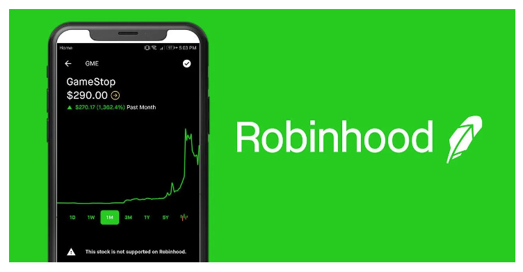

# Case Study proposal
## Robinhood

  

# Company Background
Robinhood Markets, Inc. is an American financial services company headquartered in Menlo Park, California, that facilitates commission-free trades of stocks, exchange-traded funds and cryptocurrencies as well as individual retirement accounts via a mobile app introduced in March 2015. Robinhood is a FINRA-regulated broker-dealer, registered with the U.S. Securities and Exchange Commission, and is a member of the Securities Investor Protection Corporation. The company's revenue comes from three main sources: interest earned on customers' cash balances, selling order information to high-frequency traders and margin lending. As of March 2022, Robinhood had 22.8 million funded accounts and 15.9 million monthly active users.In April 2022, Robinhood rolled out a cryptocurrency wallet to more than 2 million users.
RobinHood offers unlimited commission free trading for
 * stocks in U.S. public companies,
 * ETF's (exchange traded funds),
 * Stock options, and 
 * Cryptocurrencies
 How can they do this? Their revenue comes from sources that other brokers might consider ancillary,
 such as
 * Lending: RobinHood can lend the idle cash in its customers’ accounts, much as a bank does.
RobinHood can also lend stock held in customers’ accounts (Stock lending is a big business
because a short sale is actually a sale of borrowed shares, so short sales cannot proceed until the
relevant shares are borrowed.).
* Margin: For a fee, RobinHood extends credit to customers to buy sceurities with an arrangement
known as "buy on margin"

# Technologies Used By RobinHood
RobinHood customers primarily access the RobinHood trading platform via an easy-to-use mobile app,
in contrast to the PC focus of most of the more established players, such as Schwab or E*Trade. 
This, of course, appeals to RobinHood’s target market, i.e. Millennials, a demographic segment that has been
under-served by established banks and brokerage firms. Another Millennial-friendly difference between
RobinHood and the others is that RobinHood accounts have no minimum deposit.

In 2018, RobinHood developed its won clearing operation
Online brokerage Robinhood just paved the way for expansion by getting rid of a key middleman.
The fintech start-up, famous for its zero-fee trading platform, spent the past two years building an independent clearing system that will allow it to settle and clear transactions and provide custody for assets, the company announced Wednesday.

“It’s the only system that has been built from scratch on modern technology in the past decade,” co-CEO and co-founder Vlad Tenev told CNBC in a phone interview. “It’s a huge investment in the future of Robinhood.”
About seventy Robinhood employees based in Lake Mary, Florida, quietly built the “Clearing By Robinhood” technology from scratch, and worked on getting necessary regulatory approval. To do so, the company formed a new entity called Robinhood Securities in 2016 and received regulatory approvals from the Financial Industry Regulatory Authority, the Depository Trust & Clearing Corp. and the Options Clearing Corp. 
# Strength of Robinhood
Last December, RobinHood announced that they plan to offer no-fee, no-minimum checking accounts 
with a 3% interest paid on account balances, a far better deal than established banks. This offering should
be viewed as part of larger initiative to make "RobinHood look like a full-service consumer finance
company," in the words of co-founder Baiju Bhatt.
RobinHood’s fee structure (or, rather, no-fee structure) illustrates the dramatic cost savings that efficient internet processing can provide. It also demonstrates how such processing can disrupt the commission-based business model of other, more established on-line brokerages, such as Fidelity or Charles Schwab. And on-line stock trading is an enormous business, serving as one of the two killer apps that powered the growth of the internet in the 1990’s (the other was internet pornography).
Not surprisingly, then, RobinHood’s growth has been spectacular. Even though it was founded in 2013, it has more customers than E*Trade Financial, which was founded in 1982. Jan Hammer of Index
Ventures, an early investor, thinks that RobinHood will indeed execute on Bhatt’s vision, stating
“They’re going to be the Amazon of financial services.”
Certainly, there is much in financial services that is ripe for disruption. Why do average credit card interest rates hover at 14% per annum, for example, even though credit card providers also extractadditional transaction fees from merchants? OK, these interest charges and fees must cover lots of creditcard fraud, but the incumbents are not doing as much as they could to mitigate it (like eliminating thedeluge of unsolicited credit card mail-in offerings that criminals can so easily use to generate phonyaccounts).
In any case, RobinHood’s demonstrated ability to provide extremely inexpensive financial services at scale suggests that it is a business to watch.
# Future Of RobinHood
As Robinhood’s performance struggles, giving up generous remuneration feels like solidarity. But the chances of the founders getting their payout looked thin anyway. To hit the lower end of their share-price target, Robinhood’s market capitalization would have to increase more than 10-fold over the next six years. It’s a climb rarely achieved among big companies; Amazon.com (AMZN.O) is a notable exception.

# Contributors
* Adwoa Mante
* Connor Mitton

## Links
https://www.cnbc.com/2018/10/10/robinhood-launches-its-own-trade-clearing-system-as-customer-growth-surges.html (Robinhood builds its own clearing company)
(https://www.cnbc.com/2018/05/11/how-commission-free-trading-app-robinhood-tries-to-makemoney.
html)